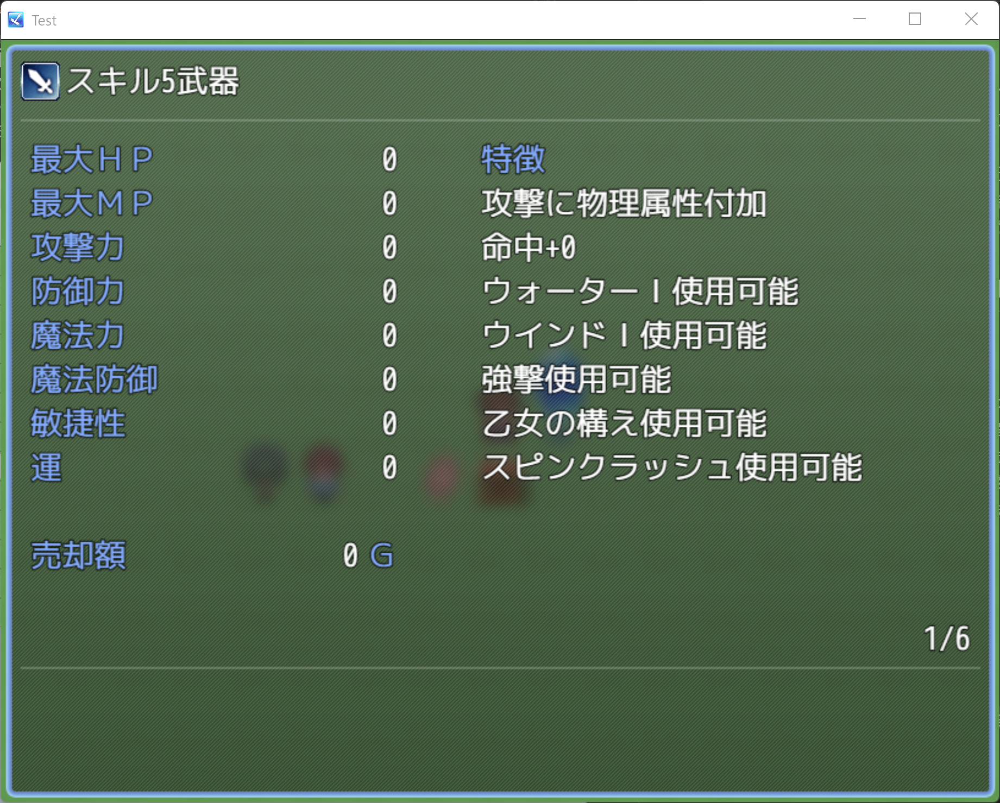
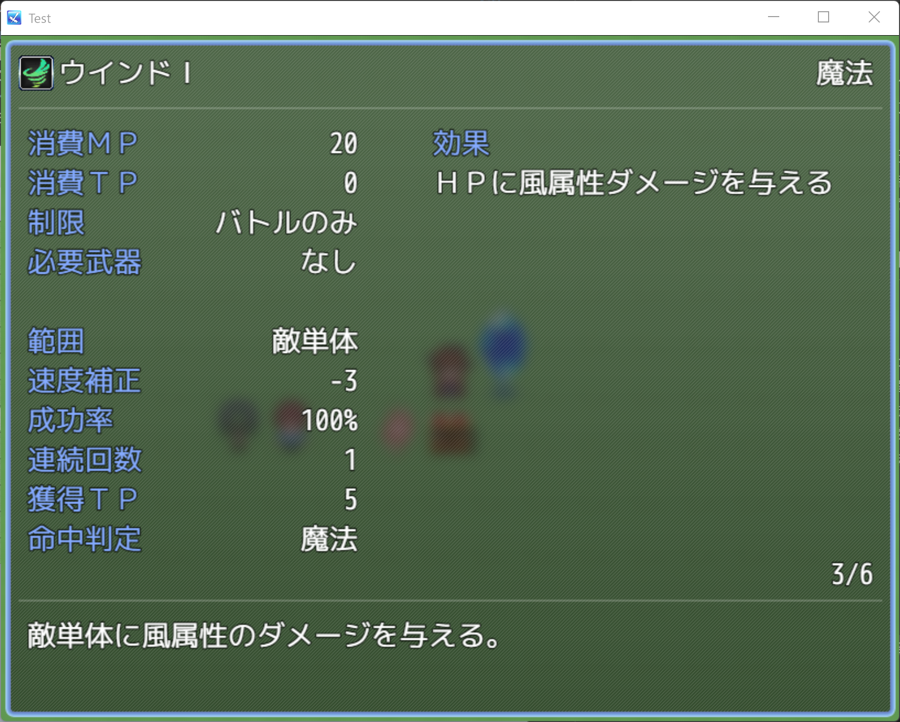

# あるく製作RPGツクールMZプラグイン集
### 注意事項
- 本リポジトリに含まれるすべてのプラグインファイルは、[MITライセンス](http://opensource.org/licenses/mit-license.php)のもとで公開されています。  
商用・非商用問わず自由に使用、改変、再配布が可能です。ただし、著作権表示およびライセンス文は削除しないでください。
- 本プラグインを使用・導入・改変・再配布したことによって発生した如何なる損害・不具合・トラブルについても、原作者および本プラグインの改変者は一切の責任を負いません。  
ご利用はすべて自己責任でお願いいたします。

### 導入方法
1. 使用したいプラグインファイル（.jsファイル）をダウンロードします。
2. RPGツクールMZのプロジェクトフォルダ内を開きます。
3. プロジェクト内の以下のフォルダに、ダウンロードしたプラグインファイルを配置します。
 `<プロジェクトフォルダ>/js/plugins/`
4. RPGツクールMZを起動し、メニューの「プラグイン管理」画面を開きます。
5. プラグインリストの空欄行をダブルクリックします。
6. 表示された「プラグインの設定」画面で「名前」プルダウンメニューから、追加したプラグインファイル名を選択します。
7. 「状態」をONに設定し、必要に応じてパラメータを変更してください。
8. 設定が完了したら「OK」ボタンを押下し、「プラグイン管理」画面を閉じます。

## ARTM_TMDescriptionExMZExByAlk.js

### 概要
- TMDescriptionEx（原作者：tomoaky様）をMZに移植したARTM_TMDescriptionExMZ（改変者：Artemis様）に以下の機能を追加します。
  - 詳細説明を表示する対象の武器・防具が特徴「スキル追加」を持つ場合、2ページ目以降に該当スキルの詳細説明を表示する。

  - 'left', 'right', 'pageup', 'pagedown'に該当する入力でページを変更する。

  - 上記機能により詳細説明画面が2ページ以上あるとき、ページ番号を表示する。

- 本プラグインは、ARTM_TMDescriptionExMZの拡張ではなく、改変を加えた別バージョンです。
そのため、ARTM_TMDescriptionExMZと同時に導入・使用することは推奨されません。

### 導入後のイメージ
|  |  |
|:---:|:---:|
| 「スキル追加」を5つ持つ武器|「スキル追加」で追加されるスキル|

### パラメータ

#### isEnableTraitSkillAddDescription
- 「スキル追加」に該当するスキル詳細を表示する機能を有効化します。
  |設定値|詳細|
  |---|---|
  |true|有効|
  |false|無効|

#### isVisiblePageNumber
- ページ番号を表示する機能を有効化します。
  |設定値|詳細|
  |---|---|
  |true|表示|
  |false|非表示|

#### pageNumberPositionType
- ページ番号を表示する位置を設定します。
  |設定値|詳細|
  |:---:|---|
  |0|詳細説明画面上部罫線の下|
  |1|詳細説明画面下部罫線の上|
  |2|詳細説明画面右下|
---
 

## ZZ_PluginCombiner.js

### 概要
- 本プラグインは、他の作者様によって制作された既存の複数のプラグインと組み合わせて、機能を改変、追加するプラグインです。
- **※使用する際には、依存対象のすべてのプラグインを必ず導入してください。**
- **※本プラグインは、必ず「プラグイン管理」画面の <u>最後</u> に追加してください。**
 （プラグインリストの一番下に表示された状態にしてください）

### パラメータ

#### isEnable_AlchemySystem_ARTM_TMDescriptionExMZ
- AlchemySystem（原作者：うなぎおおとろ様）とARTM_TMDescriptionExMZ（原作者：tomoaky様、MZ移植：Artemis様）の機能組み合わせを有効化します。
- ※ARTM_TMDescriptionExMZではなく、ARTM_TMDescriptionExMZExByAlkを使用しても動作します。
  |設定値|詳細|
  |---|---|
  |true|合成画面で詳細説明画面が表示可能になる|
  |false|上記機能が無効|

#### isEnable_SkillTree_ARTM_TMDescriptionExMZ
- SkillTree（原作者：うなぎおおとろ様）とARTM_TMDescriptionExMZ（原作者：tomoaky様、MZ移植：Artemis様）の機能組み合わせを有効化します。
- ※ARTM_TMDescriptionExMZではなく、ARTM_TMDescriptionExMZExByAlkを使用しても動作します。
  |設定値|詳細|
  |---|---|
  |true|スキルツリー画面で詳細説明画面が表示可能になる|
  |false|上記機能が無効|

---

## ライセンス

このプラグインは MIT ライセンスのもとで公開されています。  
詳細は以下のURLをご参照ください。
 http://opensource.org/licenses/mit-license.php
